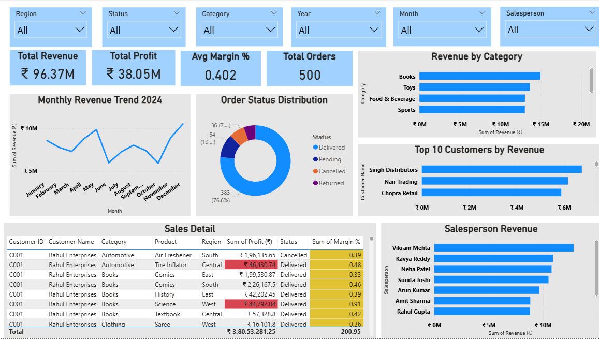

# Business-Sales-Intelligence
Sales data analysis using SQL, Python, Power BI and AI business recommendations
# Business Sales Intelligence 📊

## Goal
Analyze sales data to identify trends,
improve revenue and generate AI-driven
business recommendations.

---

## Tools Used
| Tool | Purpose |
|------|---------|
| MySQL | Database and SQL queries |
| Python (Pandas) | Data cleaning and analysis |
| Power BI | Dashboard and KPIs |
| ChatGPT | AI business recommendations |
| Excel | Data preparation |

---

## Skills Demonstrated
- SQL: Joins, Aggregations, Window Functions
- Python: Data Cleaning, Feature Creation
- Power BI: KPI Dashboard, Charts, Slicers
- AI: Business Insights using ChatGPT

---

## Dataset
- 500 sales orders — Full Year 2024
- 20 customers across India
- 8 categories: Electronics, Clothing,
  Furniture, Food, Sports, Books, Toys, Auto
- 10 salespersons

---

## What I Did

### 1. SQL Analysis
- Monthly revenue trend analysis
- Top customers by revenue
- Profit margins by category
- CTE for regional performance
- Window functions for running totals
- Salesperson ranking

### 2. Python Analysis
- Data cleaning with Pandas
- Feature engineering: Month, Quarter
- Profit category segmentation
- Revenue analysis by category
- Top customer identification

### 3. Power BI Dashboard
- KPI Cards: Total Revenue, Total Profit,
  Avg Margin %, Total Orders
- Monthly Revenue Line Chart
- Category Revenue Bar Chart
- Order Status Donut Chart
- Top 10 Customers Bar Chart
- Salesperson Performance Chart
- Sales Detail Table with filters

### 4. AI Business Recommendations
- Used ChatGPT for executive summary
- Top 3 business insights generated
- Revenue improvement strategies
- Next quarter forecast

---

## Key Findings
- Electronics is top revenue category
- Top 5 customers = 45% of revenue
- August-September shows revenue decline
- Average margin: 28.5%

---

## Files in This Repository
| File | Description |
|------|-------------|
| Business_Sales_No_Symbol.xlsx | 500 orders dataset |
| sales_queries.sql | All SQL queries |
| sales_analysis.py | Python analysis code |
| dashboard_screenshot.png | Power BI dashboard |

---

## Dashboard Preview

---

## Contact
- GitHub: fayajunddinshaikh05
